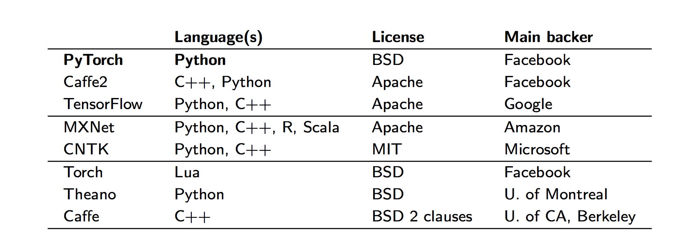

```{r setup, eval=TRUE,echo=FALSE}
knitr::opts_chunk$set(error = TRUE)
knitr::opts_chunk$set(echo = TRUE)
suppressMessages(library("tidyverse"))
library(keras)
library(tensorflow)
suppressMessages(library(GGally))
```


# Quelles solutions pour le deep learning en R ?

Le succès des réseaux de neurones profonds a conduit à un large éventail de cadres et de bibliothèques pour différents langages de programmation. Les exemples incluent Caffee, Theano, Torch et Tensor Flow, entre autres (Voir Figure).





En R, il existe de nombreux packages, qui implémentent le paradigme des réseaux de neurones ou font le lien avec une librairie existante dans un autre langage. Sans être exhaustif:

  - nnet, les bons vieux perceptrons multicouches avec le  package nnet (disponible dans la version de base de R), maintenu par le légendaire Brian Ripley,
  - RSNNS offre une interface avec le simulateur de réseau neuronal de Stuttgart (SNNS).
  - FCNN4R offre une interface avec la bibliothèque FCNN permet des réseaux neuronaux artificiels extensibles par l'utilisateur,
  - rnn implémente des réseaux neuronaux récurrents,
  - deepnet (réseau de neurones feed-forward, machine de Boltzmann restreinte, réseau de croyances profondes, autoencodeurs empilés)
x  - RcppDL, autoencoder de débruitage, autoencoder de débruitage empilé, machine de Boltzmann restreinte, réseau de croyance profond
  - h2o, réseau de neurones feed-forward, autoencoders profonds 
  - DeepNet a également implémenté des réseaux de neurones profonds, des réseaux Deep Belief et des machines Boltzmann restreintes
  - mxNet  contient des modèles pré-formés pour la reconnaissance d'objets.
  - keras de RStudio est une API (Application programming interface) de réseaux neuronaux de haut niveau développée dans le but de permettre une expérimentation rapide. 


# Keras

Keras est écrit en python à l'origine. 
Keras prend en charge à la fois les réseaux à convolution et les réseaux récurrents (ainsi que les combinaisons des deux), s'exécute de manière transparente sur les unités CPU et GPU et peut fonctionner sur plusieurs back-end, notamment TensorFlow (https://tensorflow.rstudio.com/ ), CNTK et Theano. 


Deux packages R offrent une interface avec Keras:

  - le paquet kerasR, qui a été écrit par Taylor Arnold, 
  - le package R keras de Rstudio
  
Dans la suite nous allons  utiliser le package de R studio.  

Quelques liens vitaux sur le sujet:

  - Le site dédié:  https://keras.rstudio.com/
  - La cheat-sheet de Rstudio sur le sujet: https://github.com/rstudio/cheatsheets/raw/master/keras.pdf
  

# Installation

L'utilisation de Keras présuppose l'installation de python 3.6. 

Préalablement au lancement de Rstudio il faut donc 
  - Vérifier que  `python 3.6` est installé (ou bien l'installer)
  - Installer `miniconda` (https://conda.io/miniconda.html)


Il faut installer  le package keras qui gère l'interface et un code de réseaux de neurones profonds. Nous allons utiliser Tensorflow pour l'exemple. 


```{r installation, eval=FALSE}
install.packages('keras')
install.packages('tensorflow')
```


```{r libraries, eval=FALSE}
library(keras)
library(tensorflow)
install_keras()
install_tensorflow()
```

# Exemples

## Reconnaissance de caractères


La base de données MNIST (base de données modifiée de l'Institut national des normes et de la technologie) est une vaste base de données de chiffres manuscrits couramment utilisés pour la formation de divers systèmes de traitement d'images.  La base de données est également largement utilisée pour la formation et les tests dans le domaine de l'apprentissage automatique.  Il a été créé en «remixant» les échantillons des jeux de données originaux du NIST. Les créateurs ont estimé que puisque le jeu de données d'entraînement du NIST provenait des employés du Bureau du recensement américain, alors que l'ensemble de données de tests provenait d'étudiants américains, il n'était pas bien adapté aux expériences d'apprentissage automatique . En outre, les images en noir et blanc du NIST ont été normalisées pour tenir dans une boîte englobante de 28x28 pixels et anti-aliasées, ce qui a introduit des niveaux de niveaux de gris. 


### Chargement des données partage test et apprentissage

```{r mnist,cache=TRUE, fig.show='asis', fig.keep='all'}
#loading the keras inbuilt mnist dataset
data<-dataset_mnist()

#separating train and test file
train_x<-data$train$x
train_y<-data$train$y
test_x<-data$test$x
test_y<-data$test$y

rm(data)

# converting a 2D array into a 1D array for feeding into the MLP and normalising the matrix
train_x <- array(train_x, dim = c(dim(train_x)[1], prod(dim(train_x)[-1]))) / 255
test_x <- array(test_x, dim = c(dim(test_x)[1], prod(dim(test_x)[-1]))) / 255

image(matrix(train_x[2,],28,28,byrow=T), axes = FALSE,col=gray.colors(255))
#converting the target variable to once hot encoded vectors using keras inbuilt function
train_y_cat<-to_categorical(train_y,10)
test_y_cat<-to_categorical(test_y,10)
train_y <- train_y_cat
test_y <- test_y_cat
```


### Construction du réseau de neurones


#### Dense:  `layer_dense(units = 784, input_shape = 784)`

Le terme `dense` se réfère à une couche dont les unités sont complètement connectées à la couche précédente dite d'entrée. 

#### Dropout:  `layer_dropout(rate=0.4)`

Le terme `dropout` se réfère à des unités ignorées (qu'elles soient  cachées ou  visibles) dans un réseau de neurones pendant la phase d'entraînement. 
Les unités ignorées ne sont pas considérées pendant une passe avant ou arrière particulière.

A chaque étape d'entraînement, 
des neurones   sont donc soit supprimés (ou plutot  ignorés) avec  probabilité $1-p$
soit conservés avec  probabilité $p$, 
de sorte que l'apprentissage est effectué sur un sous réseau;
les connexions entrantes et sortantes vers un neurone supprimé sont également supprimées.

Le dropout est une méthode de régularisation qui permet d'éviter le surapprentissage. 


#### Activation: `layer_activation(activation = 'relu')`

Il existe de nombreuses fonctions d'activation. La plus simple et rapide à calculer est la linéaire rectifiée:  $f(x) = x^+ = max(0,x)$.


```{r mnist networkdefinition}
model <- keras_model_sequential()

# defining the model with 1 input layer[784 neurons], 
# 1 hidden layer[784 neurons] with dropout rate 0.4 
# and 1 output layer[10 neurons]
# i.e number of digits from 0 to 9

model %>% 
layer_dense(units = 784, input_shape = 784) %>% 
layer_dropout(rate=0.4)%>%
layer_activation(activation = 'relu') %>% 
layer_dense(units = 10) %>% 
layer_activation(activation = 'softmax')

model %>% compile(
loss = 'categorical_crossentropy',
optimizer = 'adam', 
metrics = c('accuracy')
)
```


```{r learning, eval=TRUE}
learning_history <- model %>% fit(train_x, train_y, epochs = 30, batch_size = 1000)
loss_and_metrics <- model %>% evaluate(test_x, test_y, batch_size = 128)
```


```{r output}
summary(model)
plot(learning_history)
```

Comment utiliser le modèle pour prédire ?

```{r} 
prediction <-  model %>% predict(test_x) 
image(as.matrix(prediction[1:5,]))
```

## Les Iris : classification 


```{r iris}
data(iris)
ggpairs(iris, aes(colour = Species, alpha = 0.4))

x_iris <- iris %>%  select(-Species) %>%  as.matrix %>% scale  

y_iris <- to_categorical(as.integer(iris$Species)-1)
```


```{r stratified_train_test_splitting}
set.seed(0)
ntest<-15 # number of test samples in each class
test.index <-
  tibble(row_number =1:nrow(iris),Species = iris$Species)  %>% 
  group_by(Species) %>% 
  sample_n(ntest) %>% 
  pull(row_number)

train.index <- (1:nrow(iris))[-test.index]

x_iris_train<-x_iris[train.index,]
y_iris_train<-y_iris[train.index,]
x_iris_test<-x_iris[test.index,]
y_iris_test<-y_iris[test.index,]
```

```{r}
model<- keras_model_sequential()
model %>% 
layer_dense(units = 4, input_shape = 4) %>% 
layer_dropout(rate=0.1)%>%
layer_activation(activation = 'relu') %>% 
layer_dense(units = 3) %>% 
layer_activation(activation = 'softmax')

model %>% compile(
loss = 'categorical_crossentropy',
optimizer = 'adam', 
metrics = c('accuracy')
)
learning_history <- model %>% fit(x_iris_train, y_iris_train, epochs = 200, validation_split=0.0)
loss_and_metrics <- model %>% evaluate(x_iris_test, y_iris_test)

estimation <- apply(predict(model,x_iris_test),1,which.max)
truth <- apply(y_iris_test,1,which.max)
table(estimation, truth)
```


```{r model_for_iris_2_layers}
model_autoencoder <- keras_model_sequential()

model_autoencoder %>% 
  layer_dense(units = 2, activation = 'linear',input_shape = ncol(x_iris),name = "inter_layer") %>% 
 layer_dense(units = 4, activation = 'linear') 

model_autoencoder %>% compile(
     loss = 'mse',
     optimizer = 'adam',
     metrics = 'mse'
 )

model_autoencoder %>% fit(
     x_iris_train, 
     x_iris_train, 
     epochs = 1000, 
  batch_size = 16,
  shuffle  = TRUE,
    validation_split = 0.1,     
)

model_projection = keras_model(inputs = model_autoencoder$input, outputs = get_layer(model_autoencoder,"inter_layer")$output)

intermediate_output = predict(model_projection,x_iris_train)


```


```{r}
library(FactoMineR)
res.pca <- PCA(x_iris_train, graph = FALSE)

par(mfrow=c(1,2))
plot(intermediate_output[,1],intermediate_output[,2],col = y_iris_train %*% (1:3))
plot(res.pca$ind$coord[,1],res.pca$ind$coord[,2], col = y_iris_train %*% (1:3))

```


```{r saving_loading}
save_model_hdf5(model, "my_model.h5")
model <- load_model_hdf5("my_model.h5")
```

https://towardsdatascience.com/pca-vs-autoencoders-1ba08362f450

https://www.datacamp.com/community/tutorials/keras-r-deep-learning

https://www.analyticsvidhya.com/blog/2017/06/getting-started-with-deep-learning-using-keras-in-r/
