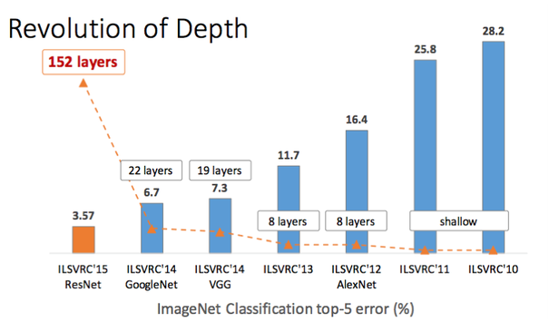

```{r setup, include=FALSE}
knitr::opts_chunk$set(echo = FALSE,encoding = "UTF-8")
```

# Introduction : apprentissage supervisé

## Exemple : reconnaissance de chiffres


## Exemple : reconnaissance de chiffres

{width=250px}


- Chaque image $i$ de chiffre est de taille $28 \times 28 = 784$ pixels
- A chaque pixel $j$ est associé un niveau de gris $x_i^j \in  \{0,\dots, 255\}$ 


## Example 1: reconnaissance de chiffres

- Les niveaux de gris stockés dans un vecteur $\mathbf{x}_i = (x_i^r)_{r=1\dots p}$, $p=784$
- $y_i \in \{0,\dots, 9\}$ : étiquette de l'image

    - $y_i$ connu pour un échantillon d'apprentissage
    - $y$ doit être prédit pour une nouvelle image $\mathbf{x}$


## Formellement
- On considère $n$ objets (images, textes, son...), décrits par $p$ caractéristiques. 

- Pour chaque objet $i$,  ces caractéristiques sont stockées dans un vecteur $\mathbf{x}_i = (x_i^1, \dots, x_i^p)$ de $\mathbb{R}^p$. 

- A chaque objet  $i$ est affectée une variable de sortie $y_i$. 

    - Si  $y_i \in \mathbb{R}^p$ : on parle de régression
    - Si $y_i \in E$ avec $E$ ensemble fini on parle 
          - de discrimination si $E = \{0,1\}$; 
          - de classement si $E=\{0,\dots, 9\}$ par exemple
          - de reconnaissance de forme si $E=\{\text{chien},\text{marmotte},...\}$

- \textbf{But}: prédire la sortie $y$ pour  un nouvel ensemble de caractéristiques $\mathbf{x}$ 

- \textbf{Comment}: apprendre  (sur un jeu de données d'apprentissage = training) une règle de prédiction ou classification et fournir cette règle pour l'appliquer à $\mathbf{x}$


## Autres exemples


- Reconnaissances de visages sur des photos $E = \{$membres d'une famille $\}$
- Reconnaissance du bord politique par l'analyse des discours  


## Différence entre estimation ou apprentissage? 


- Tradition statistique / estimation :  
    - Notion de modèle  centrale avec une finalité explicative 
    - Cherche à  approcher la réalité, modèle éventuellement basé sur une théorie physique, économique,
    - Interprétation du rôle de chaque variable explicative prépondérante dans la démarche.
    
- Apprentissage : l’objectif est essentiellement la prédiction, 
    -  meilleur modèle n’est pas nécessairement celui qui ajusterait le mieux le vrai modèle. 
    -  cadre théorique est différent et les majorations d’erreur requièrent une autre
approche :  choix  basés sur des critères de qualité de prédiction 
    - l’interprétabilité passe au deuxième plan. 

## Et le bon vieux modèle linéaire (généralisé) dans tout ça? 

$$ y_i \sim  \mathcal{F} \quad \mbox{ avec } \quad \phi(\mathbb{E}[y_i]) = \mathbf{x}^T\beta$$

- Si les dimensions du problèmes $(n, p)$ sont raisonnables
- Si les  hypothèses relatives au modèle (linéarité) et aux distributions sont vérifiées
- ALORS  :  les techniques statistiques de modélisation tirées
du modèle linéaire général sont optimales (maximum de vraisemblance)
- On ne fera pas mieux, surtout dans le cas d’échantillons de taille restreinte

## MAIS 
- Dès que les hypothèses distributionnelles ne sont pas vérifiées,
- Dès que les relations supposées entre les variables ou la variable à modéliser
ne sont pas linéaires 
- Dès que le volume des données (big data) est important, 

On se tournera vers d’autres méthodes qui viennent concurrencer les modèles statistiques rudimentaires.


# Deep learning

## Deep learning: introduction

- Définition (tentative): ensemble de méthodes d'apprentissage cherchant à modéliser les données avec des architectures complexes combinant diverses transformations non-linéaires. 

$$ \mathbf{x} \mapsto f(\mathbf{x},\theta) \mbox{ telle que } 
y \simeq f(\mathbf{x},\theta)$$

- Les briques élémentaires du Deep Learning sont les **réseaux neuronaux**. 
- Ces briques sont combinées pour former des **réseaux de neurones profonds**.


## Domaines d'application 

Ces techniques ont permis des progrès significatifs dans les domaines suivants:

- traitement d'image et de son : reconnaissance faciale,  reconnaissance automatique de la parole  (transformation d'une voix en texte écrit),
- vision par ordinateur  : imiter la vision humaine (machine voyant plusieurs objets à la fois)
- Traitement automatique du langage naturel
- Classification de textes (par exemple détection de spam)
    
Quantité infinie d'applications potentielles


## Différentes types d'architectures pour les réseaux neuronaux

- *Les perceptrons multicouches* : les plus vieux et les plus simples
- *Les réseaux neuronaux convolutifs* :  très performants pour le traitement d'image
- *Les réseaux neuronaux récurrents*, utiles pour les données séquentielles (textes ou séries temporelles)

- Tous sont basés sur des cascades profondes de couches
- Requiert des algorithmes d'optimisation intelligents (stochastiques en général), une initialisation minutieuse et un choix malin de structure. 
- Résultats impressionnnants mais peu de justifications théoriques pour l'instant


## Neurone artificiel

- **Un neurone** est une application non linéaire en ses paramètres qui, à un vecteur $\mathbf{x}$ d'entrée associe une sortie $f(\mathbf{x})$ :  

- Plus précisément, le $j$-ième neurone artificiel  $f_j$ s'écrit
  $$f_j(\mathbf{x}) = \phi(<w_j,\mathbf{x}> + b_j)$$

où

- $<w_j,\mathbf{x}> = \sum_{r=1}^p w_j^r x^r$

- Les quantités $w_j = (w_j^1,\dots,w_j^p)$ pondèrent les variables d'entrée $(x^1, \dots,x^p)$

- $b_j$ est appelé le biais du neurone $j$. 

- $\phi$ est appelée fonction d'activation


## Modèle basique à un neurone

On explique la variable de sortie $y$ par 
$$ y \simeq f(\mathbf{x},\theta) =  \phi(<w,\mathbf{x}> + b)$$


Si  $\phi(z) =z$  et un seul neurone $\Rightarrow$  modèle linéaire simple
    
    
## Choix de la fonction d'activation $\phi$


-  Si $Y \in \{0,1\}$ et on souhaite prédire $P(Y=1|x)$  :  la logistique $\phi(z) = \frac{1}{1+e^{-z}} \in [0,1]$ 
  
- *Généralisation*: Si $Y \in E$ ($E$ espace fini) et prédiction de  $P(Y= e|x)$ : $softmax$
$$\phi(z) =\left(\frac{e^{z_e}}{\sum_{e \in E} e^{z_e}}\right)_{e \in E}$$
- La fonction tangente hyperbolique: $\phi = \tanh:\mathbb{R}  \mapsto [-1,1]$ 
- La fonction de seuil: $\phi(z) = 1_{z>s} \in \{0,1\}$ 
- La partie positive: **rectified linear unit (ReLU)** $\phi(z) = max(z,0)$
    - Permet de prédire des valeurs positives. Continue mais non dérivable


## Propriétés 
```{r, echo=FALSE}
Sigm_f <- function(x){1/(1 + exp(-x))}
pos_f <- function(x){0.5 * (abs(x) + x)}
plot(c(-2,2),c(-2,2),type = 'n',ylab = expression(phi(z)),xlab = "z")
abline(a = 0,b = 1,col = 'red')
curve(Sigm_f,col = 'green',add = TRUE)
curve(tanh,col = 'orange',add = TRUE)
curve(pos_f,col = 'blue',add = TRUE)
legend('bottomright',c("Identité","Logistique","Tangeante Hyper","ReLU"), lty = c(1,1,1,1),
       col = c('red','green','orange','blue'))

```

Différentes propriétés de différentiabilité : important au moment de l'optimisation des $w$ et $b$

## Réseaux de neurones ou perceptrons multicouches

- Structure composée de différentes couches cachées de neurones dont la sortie sert d'entrée aux neurones de la couche suivante
- Les fonctions d'activations sont les mêmes dans les différentes couches, seule la dernière est différente (à adapter à l'objectif : classification ou régression)

## Exemple
{width=250px}

- Input layer  : autant de noeuds que de variables $x^r$ : $p$
- Hidden layer : nombre de neurones à fixer (ici 4 puis 3)
- Output layer : 1 noeud  = $y$

## Réseau de neurones:  formellement

On note $J_{\ell}$ le nombre de neurones de la couche $\ell$

- Couche $0$ : $h^0(\mathbf{x}) = \mathbf{x} \in \mathbb{R}^p$
- Pour les couches cachées $\ell = 1\dots L$: 
      
      - On crée $J_{\ell}$ neurones : pour tout $j = 1 \dots J_{\ell}$ : 
        
        \begin{eqnarray*}
        a^{(\ell)}_j(\mathbf{x}) &=& b^{(\ell)}_j + \sum_{m=1}^{J_{\ell-1}} W^{(\ell)}_{jm} h_m^{(\ell-1)}(\mathbf{x}) \\
        &=& b^{(\ell)}_j + < W^{(\ell)}_{j},  h ^{(\ell-1)}(\mathbf{x}) >
        \end{eqnarray*}
        
        $$h_j^{(\ell)}(\mathbf{x}) = \phi(a_j^{(\ell)}(\mathbf{x}))$$
      
      - Vectoriellement : 
       $$a^{(\ell)}(\mathbf{x}) = b^{(\ell)} +W^{(\ell)} h^{(\ell-1)}(\mathbf{x}) \in \mathbb{R}^{J_{\ell}}$$
       $$h^{(\ell)}(\mathbf{x}) = \phi(a^{(\ell)}(\mathbf{x}))$$
       où $W^{(\ell)}$ est une matrice $J_{\ell} \times J_{\ell-1}$
      
    
    
## Réseau de neurones:  formellement

- Pour la dernière couche : $\ell = L+1$: 

      $$a^{(L+1)}(\mathbf{x}) = b^{(L+1)} +W^{(L+1)} h^{(L)}(\mathbf{x}) \in \mathbb{R}^J$$

      $$h^{(L+1)}(\mathbf{x}) = \psi(a^{(L+1)}(\mathbf{x}))$$


## Réseau de neurones:  finalement

- $W^{(\ell)}$ est une matrice de poids de taille $J_{\ell}$ lignes et $J_{\ell-1}$ colonnes
- $W^{(L+1)}$ est une matrice de poids de taille $1$ lignes et $J_{L}$ colonnes si $y \in \mathbb{R}$
- $$\mathbf{x} \mapsto f(\mathbf{x},\theta) = \psi(a^{(L+1)}(\mathbf{x}))$$
    - Si on fait de la régression $\psi(z) = z$, 
    - Si on fait de la classification en deux classes, $\psi$ est la sigmoïde (prédiction dans $[0,1]$). 
    - Si on fait de la classification en plusieurs classes : $\psi = softmax$


##  Réseau de neurones: 

- Architecture basique puisque chaque couche dépend de la couche précédente et non des neurones de la même couche ($\Rightarrow$ réseaux de neurones récurrents)

-  Paramètres de l'architecture: 
    - nombre de couches
    - nombre de neurones dans chaque couche
    - fonctions d'activation des couches cachées  ($\phi$) et de la dernière ($\psi$) 
    
- Pour la dernière fonction $\psi$, guidé par le problème
    - Si régression : $\psi = id$ ou $g$
    - Si classification sigmoide ($\{0,1\}$) ou softmax (classification avec plus de deux catégories)
    
    


## Réseaux neuronaux récurrents

- La sortie d'un neurone peut service d'entrée à un neurone de la même couche ou d'une couche précédente. 


## Justification théorique

Hornik (1991) a prouvé que toute fonction régulière bornée de $\mathbb{R}^p$ dans $\mathbb{R}$ 
peut être approchée pour un réseau de neurones avec une couche cachée contenant un nombre fini de neurones et ayant la même fonction d'activation et $\psi  = id$. 


- Théorème intéressant d'un point de vue théorique

- En pratique : nombre de neurones de la couche cachée peut être très grand. 

- Force du deep learning :  dans le nombre de couches cachées 


# Estimation des paramètres

## Quantité à minimiser 

Etant donnée une fonction de perte $\ell(f(\mathbf{x},\theta),Y$, 

 Risque (erreur de prédiction)  : $$\mathbb{E}_{Y}[\ell(f(\mathbf{x},\theta),Y)]$$


## Fonction de perte 

- Paramètres à estimer  :  $\theta$ = poids $W^{(\ell)}$ et biais $b^{(\ell)}_j$
- Classiquement : estimation par maximisation de la ($\log$)-vraisemblance 
- Fonction de perte:   $=-\log\;$vraisemblance 
    - Cas de la régression : $Y  \sim \mathcal{N}(f(\mathbf{x},\theta), I)$
    $$ \ell(f(\mathbf{x},\theta),Y) = \| Y - f(\mathbf{x},\theta)\|^2$$
    
    - Cas de la classification $\{0,1\}$  : $Y  \sim \mathcal{B}(1,f(\mathbf{x},\theta))$
   $$ \ell(f(\mathbf{x},\theta),Y) = -Y \log(f(\mathbf{x},\theta)) - (1-Y) \log(1- f(\mathbf{x},\theta))$$ (cross-entropy)
  
    - Cas de la classification multiclasses
        $$ \ell(f(\mathbf{x},\theta),Y) =-  \sum_{e \in E} \mathbf{1}_{Y=e} \log p_{\theta}(Y = e | \mathbf{x} )$$
  
  
  
  
## Fonction de perte : remarque

- Idéalement on voudrait minimiser l'erreur de classification mais cette fonction n'est pas dérivable... 

- On lui préfèrera la "cross-entropy"
  
  

## Risque empirique    pénalisé

- $\mathbb{E}_{Y}[\ell(f(\mathbf{x},\theta),Y)]$ remplacé par risque empirique 

- Pour un échantillon d'entraînement $(\mathbf{x}_i,Y_i)_{i=1\dots n}$
  
$$ L_n(\theta) = \frac{1}{n}\sum_{i=1}^n  \ell(f(\mathbf{x}_i,\theta),Y_i)$$
  
- Pénalisation :   $$ L_n(\theta) = \frac{1}{n}\sum_{i=1}^n  \ell(f(\mathbf{x}_i,\theta),Y_i) + \lambda \Omega(\theta) $$ avec par exemple $\Omega(\theta) = \sum_{\ell,i,j} (W^{(\ell)}_{ij})^2$ ou   $\Omega(\theta) = \sum_{\ell,i,j} |W^{(\ell)}_{ij}|$
  
  
## Minimisation par descente de gradient stochastique. Rumelhart et al (1988)


- Choisir un vecteur initial de paramètres $\theta$, et un taux d'apprentissage $\eta$

- Répéter jusqu'à ce qu'un minimum approché (assez précisément) soit obtenu:

    - Diviser aléatoirement l'échantillon d'apprentissage en $N_B$ sous-échantillons (batch) de taille $m$ ($n = m \times N_B$) 
    - Pour chacun des batch $B$ poser: 
             $$ \theta:= \theta - \eta \frac{1}{m}\sum_{i \in B} \nabla_{\theta} \left\{  \ell(f(\mathbf{x}_i,\theta),Y_i) + \lambda   \Omega(\theta)\right\}$$ 


      
   

            
**Remarques**: 
    
  - Chaque itération est appelée *epoch*. 
  
  - Le nombre d'epochs est un paramètre à régler. 


## Calcul du gradient pour la régression


- $Y \in \mathbb{R}$.
- $R_i = \ell(f(\mathbf{x}_i,\theta),Y_i) = (Y_{i} - f(\mathbf{x}_i,\theta))^2$
- Fonctions d'activation $\psi$  et $\phi$ quelconques

## Dérivées partielles de $R_i$ par rapport  aux poids de la dernière couche

- Dérivées de $R_i    = \left(Y_{i} - f(\mathbf{x}_i,\theta)\right)^2= \left(Y_i - h^{(L+1)}(\mathbf{x}_i)\right)^2$ par rapport   à   $(W_j^{(L+1)})_{j=1\dots J_{L}}$

<!-- - $a^{(L+1)}(\mathbf{x}) = b^{(L+1)} +W^{(L+1)} h^{(L)}(\mathbf{x}) \in \mathbb{R}^J$ -->

-
\begin{eqnarray*}
f(\mathbf{x} ,\theta) &=& h^{(L+1)}(\mathbf{x}) \\
&=& \psi(a^{(L+1)}(\mathbf{x}))  \\
& =& \psi\left(b^{(L+1)} +\sum_{j=1}^{J_L} W_j^{(L+1)} h_j^{(L)}(\mathbf{x}) \right)
\end{eqnarray*}

- $$ \frac{\partial R_i }{\partial W^{(L+1)}_{j}} = -2\left(Y_{i} - f(\mathbf{x}_i,\theta)\right)\psi'\left(a^{(L+1)}(\mathbf{x}_i)\right)h_j^{(L)}(\mathbf{x}_i)$$ 

## Dérivées partielles de $R_i$ par rapport  aux poids de l'avant-dernière couche


- Dérivées de $R_i = \left(Y_i - h^{(L+1)}(\mathbf{x}_i)\right)^2$ par rapport   à   $(W_{jm}^{(L)})_{j=1\dots J_{L},m=1\dots J_{L-1}}$

- \begin{eqnarray*}
\frac{\partial R_i }{\partial W^{(L)}_{jm}} &=& -2\left(Y_{i} - f(\mathbf{x}_i,\theta)\right)\psi'\left(a^{(L+1)}(\mathbf{x}_i)\right) \frac{\partial}{\partial W^{(L)}_{jm}}  a^{(L+1)}(\mathbf{x}_i)
\end{eqnarray*}


## Dérivées partielles de $R_i$ par rapport  aux poids de l'avant-dernière couche


\begin{eqnarray*} 
a^{(L+1)}(\mathbf{x}) &=&  b^{(L+1)} + \sum_{j=1}^{J_L} W^{(L+1)}_j h_j^{(L)}(\mathbf{x}) \\
&=&  b^{(L+1)} + \sum_{j=1}^{J_L}  W^{(L+1)}_j \phi \left(b_j^{(L)} + \sum_{m=1}^{J_{L-1}} W^{(L)}_{jm} h_m^{(L-1)}(\mathbf{x})\right)
\end{eqnarray*}


\begin{eqnarray*}
\frac{\partial}{\partial W^{(L)}_{jm}}  a^{(L+1)}(\mathbf{x}_i)  &=&   W^{(L+1)}_j \phi' \left(b_j^{(L)} + \sum_{m=1}^{J_{L-1}} W^{(L)}_{jm} h_m^{(L-1)}(\mathbf{x}_i)\right) \\
&& \times h_m^{(L-1)}(\mathbf{x}_i)   \\
&=& W^{(L+1)}_j \phi'(a_j^{L}(\mathbf{x}_i)) h_m^{(L-1)}(\mathbf{x}_i)
\end{eqnarray*} 


## Forward Backward (en travaillant un peu) (à chaque itération)

- Etant données des paramètres courant
- \textbf{Etape de forward} : De la couche $1$ vers la couche $L+1$, on calcule les $a_j^{\ell}(\mathbf{x}_i),\phi(a_j^{\ell}(\mathbf{x}_i))$ 
- \textbf{Etape de backward} : De la couche $L+1$ vers la couche $1$, on calcule les dérivées partielles (formule de mise à jour par récurrence)


## Réglages de l'algorithme

- $\eta$: taux d'apprentissage de la descente de gradient
    - si $\eta$ trop petit, convergence très lente avec possiblement atteinte d'un minimum local
    - si $\eta$ trop grand, oscillation atour d'un optimum sans stabilisation
    - choix adaptatif du $\eta$ ($\eta$ décroissant)

- Calculs en batch permet de ne pas avoir à stocker trop de quantités dans le forward / backward    

- Evidemment multiples autres versions de l'algorithme de maximisation    (momentum correction, Nesterov accelerated gradient, etc...)
    
    
# Réseaux neuronaux plus complexes

## Réseaux neuronaux convolutifs (LeNet by LeCun et al., 1998)

- Lors du passage de l'image au vecteur : perte de la cohérence spatiale des images (formes...)

- Réseaux neuronaux convolutifs ont révolutionné l'analyse d'images (LeCun)

- CNN (convolutive neuronal networks) : composés de différentes couches de convolution, pooling et couches complètements connectées.


## En une image

{width=250px}


## Couche de convolution 

-  Image $\mathcal{I}(u,v)$ : chaque pixel  $(u,v)$ est décrit par $C$ niveaux de couleurs (channels), par exemple RGB (bleu, vert, rouge) $\Rightarrow$ tableau de taille ($M,N,C$)


-  Chaque neurone  basée sur une combinaison linéaire des signaux sur une petite région de l'image
   $$K_{u,v}*\mathcal{I}(c) =  \sum_{n=-k}^{k}\sum_{m=-k}^k K_l(n,m,c)\mathcal{I}\left(u+m,v+n,c \right)$$  
  
    $$h_{u,v} = \phi(K_{u,v}*\mathcal{I}(c)+b_{u,v})$$  
   
- On obtient un nouveau neurone  en déplaçant cette fenêtre 

      - si on déplace peu : redondance de l'information
       - si on déplace beaucoup : perte d'information 
   
## Couche de pooling (subsampling)

- Faire des moyennes ou prendre des max sur des petites régions
- $\phi$ peut être appliquée avant ou après le pooling
- Permet de réduire la dimension (nombre de variables à traîter) mais aussi de rendre le réseau moins sensible aux translations éventuelles de l'image

## Ensuite 

- Après plusieurs couches et convolution / pooling, on applique une ou plusieurs couches des *fully connected layers* (= réseau  montré avant)


## Vers des architectures de réseaux de plus en plus complexes


- Réseaux maintenant beaucoup plus complexes 

- Possible de le traiter grâce aux cartes GPU (Graphical Processor Unit) 

- Résultats du *Large Scale Visual Recognition Challenge (ILSVRC)* 

{width=250px}

# Conclusion
## Conclusion

- Vision ultra-rapide de la définition d'un réseau de neurones profonds
- En pratique : expertise repose sur comment combiner les couches et les différents types de neurones
- Références : 
      - Wikipédia
      - Cours de Wikistat par Philippe Besse (Toulouse)
      - Livre de référence : Deep Learning de Yoshua Bengio
      
      {width=50px}
      
      - Vidéo https://www.college-de-france.fr/site/yann-lecun/course-2016-02-12-14h30.htm
      - Résultats et exposés de Francis Bach

